C语言知识难点详解

1.  数组循环技巧

Index = (index+1)%n

这是向左移动

如果是向右移动

Index = (index-1)%n

如果index-1\<0;加个n

2.  计算最大公约数

Int gcd(int a,int b){\
while(b!=0){

Int temp = b;

b = a%b;

a = temp;

}

return a}

3.  判断一个数是否是质数

Int isprime(int x){

If(x\<=1) return 0;

If(x==2) return 1;

If(x%2==0)return 0;

for(int i = 3;i\*i\<=x;i+=2){

If(x%i==0) return 0;

}

Return 1;

}

4.  三元运算符

条件表达式 ? 表达式1：表达式2；

条件为真 → 执行表达式 1

条件为假 → 执行表达式 2

5.  指针

&后跟一个变量名，&负责给出该变量的地址。

\*给出存储在指针指向地址的值。

指针声明变量： int \* pi ;char \*
pc;诸如此类（和前面的\*并非是一个意思）

指针本身是一个地址（%p)

6.  指针和数组的结合

数组名是数组首元素的地址。

即 flizny == &flizny\[0\];

指针+1(比如说 u+1),是下一个元素的地址(比如说short是加2；double是加8)

7.  冒泡排序

Int arr\[n\];

For(int i=0;i\<n-1;i++））{

For(int j=0;j\<n-1-i;j++){

If(arr\[j\]\>arr\[j+1\]){

Int temp = arr\[j\];

Arr\[j\]=arr\[j+1\];

Arr\[j+1\]=temp;

}}}(j\<n-1-i是因为冒泡法是让末尾第i个元素顺序正确)

8.  qsort函数排序法

用了库函数#include \<stdlib.h\>

在主函数前声明

Int compare(const void \*a,const void \*b){

Return \*(int \*)a-\*(int \*)b;

}

之后

Qsort(arr, N, sizeof(int), compare);

顺序是数组，个数，类型，函数

9.  llabs

计算长整型数据的绝对值

10. 出现一些周期性的特征，要想到取模

11. 结构（struct）储存多种类型的数据

typedef struct {

// \... 结构体的所有属性

} Student; // \<\-\-- 用 Student 这个绰号，来代替 struct Student

12. 插入排序

Int i,j,key;

For(i=1;i\<n;i++){

Key = arr\[i\];

J = i-1;

While(j\>=0&&arr\[j\]\> key){

Arr\[j+1\]=arr\[j\];

J.  -;}

Arr\[j+1\]=key;

}}

13. 选择排序

int arr\[\];

Int temp;

For(i=0;i\<n-1;i++){

Mindex = i

For(j=i+1;j\<n;j++){

If(arr\[j\]\<arr\[mindex\]){

Mindex = j;

}

}

temp = arr\[mindex\];

Arr\[mindex\]=arr\[i\];

Arr\[i\] = temp;

}

14. 差分数组

遍历数组区间进行修改时速度可能会很慢，所以我们可以只标记区间的两端，一个是起点，还有一个是种点的下一位（比如说diff\[X\]
+= K（区间起点加 K），diff\[Y+1\] -= K（区间终点的下一位减 K）。）

之所以有减k是因为来抵消前面的操作，之后进行sum求和就行。

15. 栈空间（stack）是计算机程序运行时内存中的一块区域，用于存储局部变量、函数调用的上下文（如返回地址、参数）等，由系统自动管理（分配和释放）

如果数组过大建议声明在全局变量中

16. fgets指令

fgets(存储字符串的数组, 最大读取长度, 读取来源);

一般读取来源写"stdin"，意味着键盘输入

读取到换行符 \\n 或文件末尾或达到长度限制时停止，且会把换行符 \\n
作为字符串的一部分存入 str，然后会自动加\\0，

这里一般要结合strcspn

s1\[strcspn(s1, \"\\n\")\] = \'\\0\';

那为什么用fgets呢？是因为scanf输入字符串的话他会把"空格、回车、制表符"
当成 "字符串的结束标志"

gets（s）也允许带空格，然后会自动加\\0。

Put（s）输出时遇\\0将其变成\\n。

17. isupper是\<ctype.h\>的函数，就是判断一个字符是不是「大写英文字母」（A-Z），是就返回非
    0（真），不是就返回 0（假）

Isdigit 更简单：专门判断一个字符是不是「数字字符」（即 \'0\' 到 \'9\'） ------
是就返回非 0（真），不是就返回 0（假）。

isalpha就是单纯的看是不是英文字

18. 对内存的理解

栈区（stack）（函数结束时自动释放。）

• 存放：局部变量、函数参数、返回地址。主函数的变量也算。

• • 特点：由编译器自动分配和释放，空间较小。

• void func() {

int a = 10; // a 在栈区

}

堆区（heap）

• 存放：程序运行时动态分配的内存（malloc, calloc, free）。

• • 特点：需要程序员手动申请和释放，否则会内存泄漏。

• • 举例：

• int \*p = (int\*)malloc(sizeof(int));

\*p = 20; // p 指向堆区的一块空间

free(p); // 释放

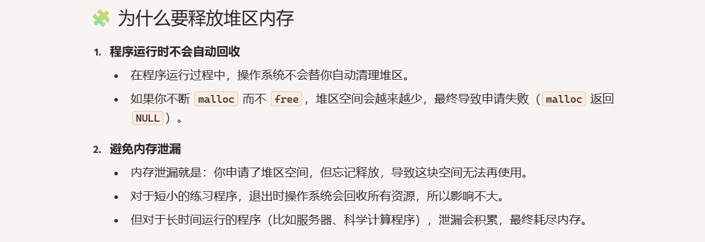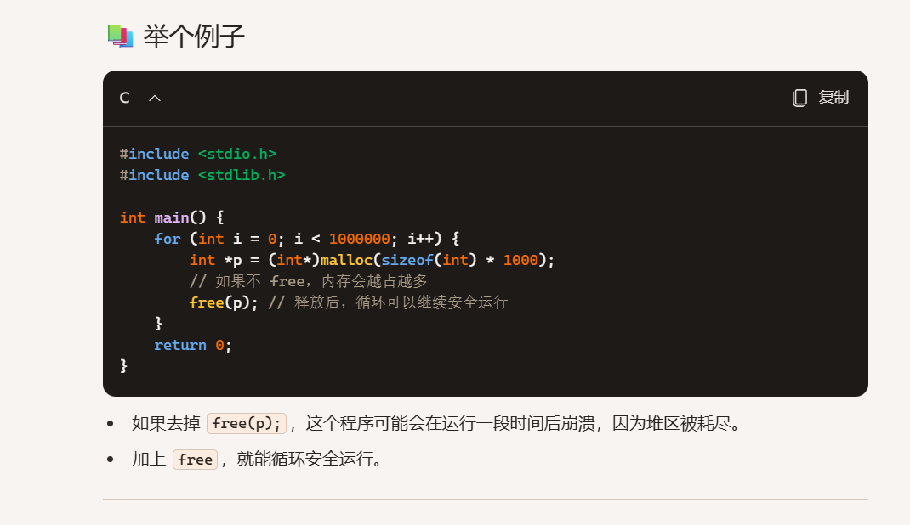

全局/静态区（程序结束时由系统回收。）

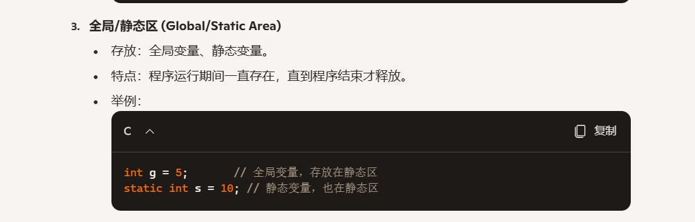

常量区（程序结束时由系统回收。）

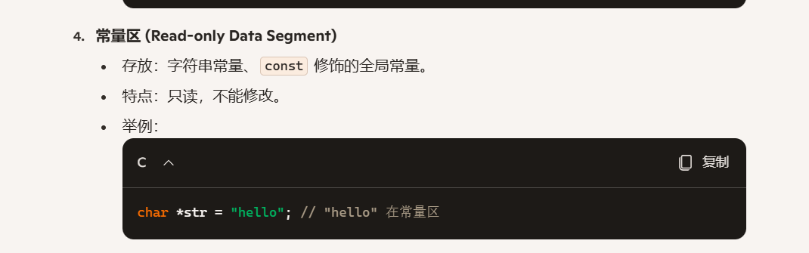

内存（RAM）

就是计算机里的一块高速存储空间，用来临时保存程序运行时的数据。

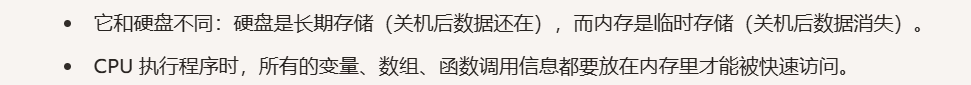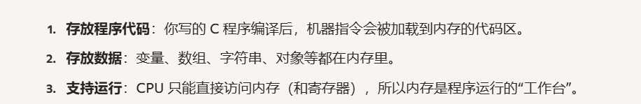

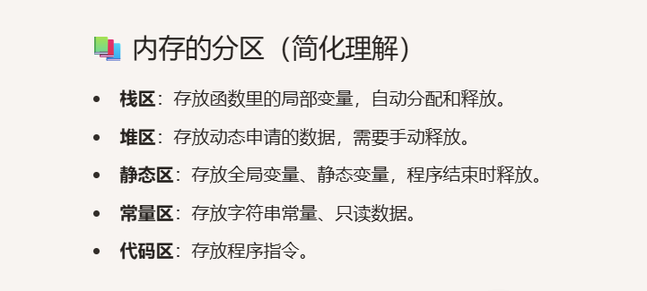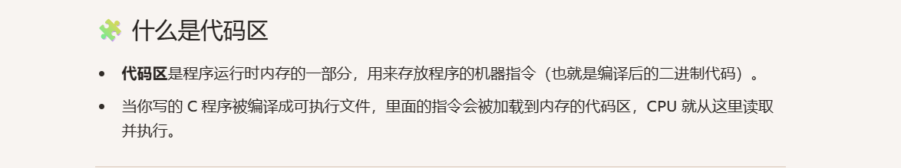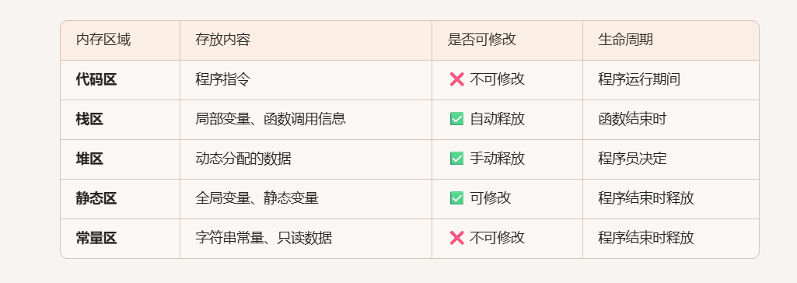

19. 字符串和数组和指针的联系

在 C
语言里，**数组名就是指针常量，指向首元素；字符串本质上是字符数组，以**
\\0
**结尾；指针是连接它们的桥梁**。指针可以遍历数组，也能操作字符串，因此三者关系非常紧密。

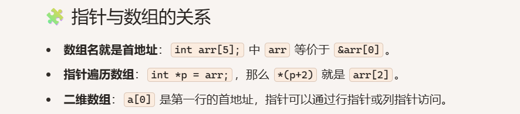

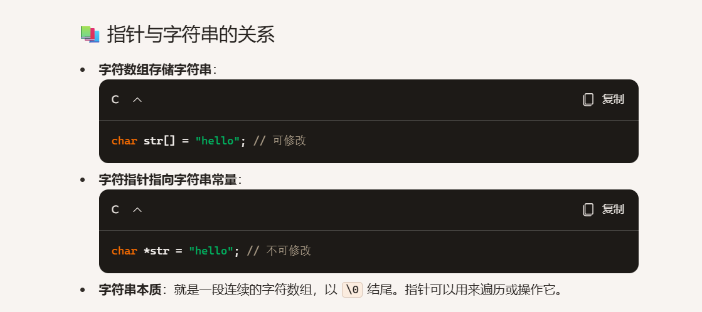

20. sprintf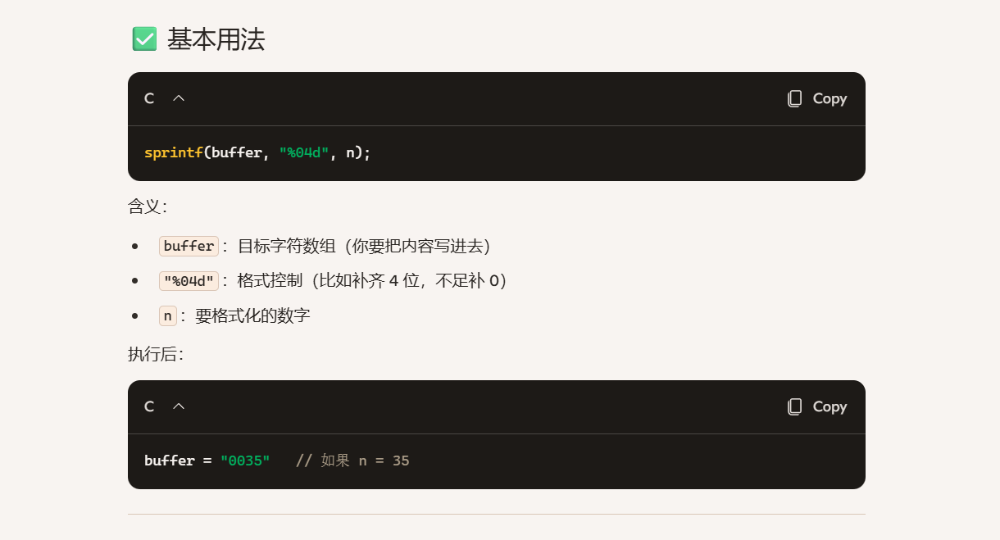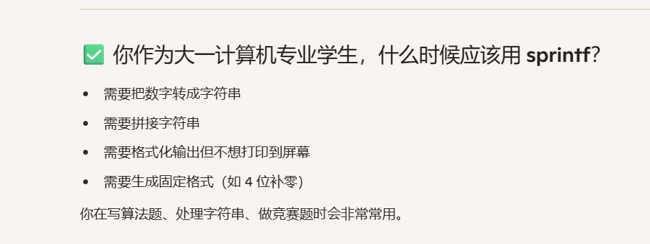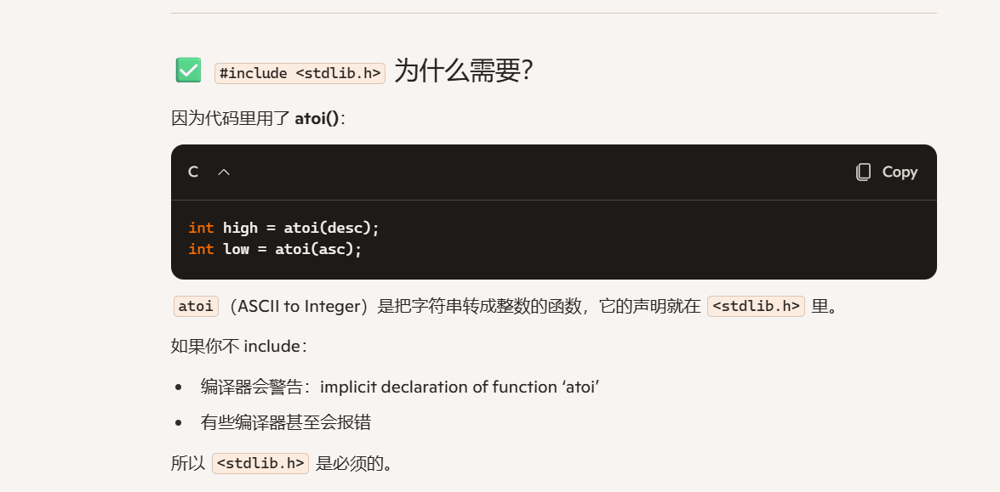

21. 位运算

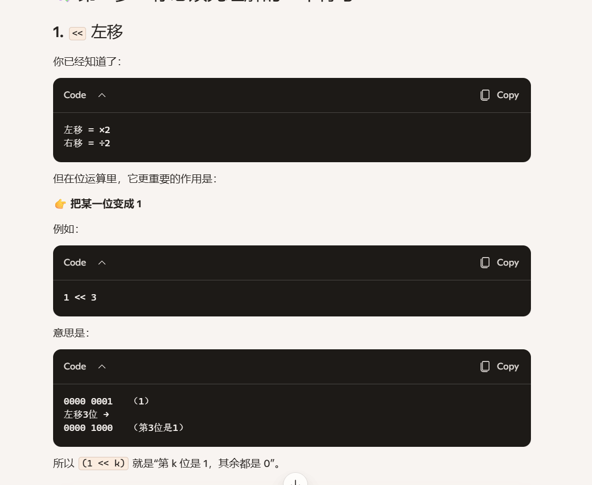

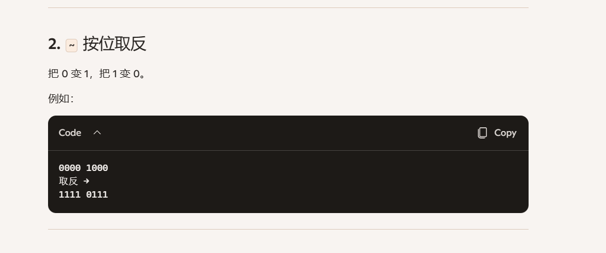

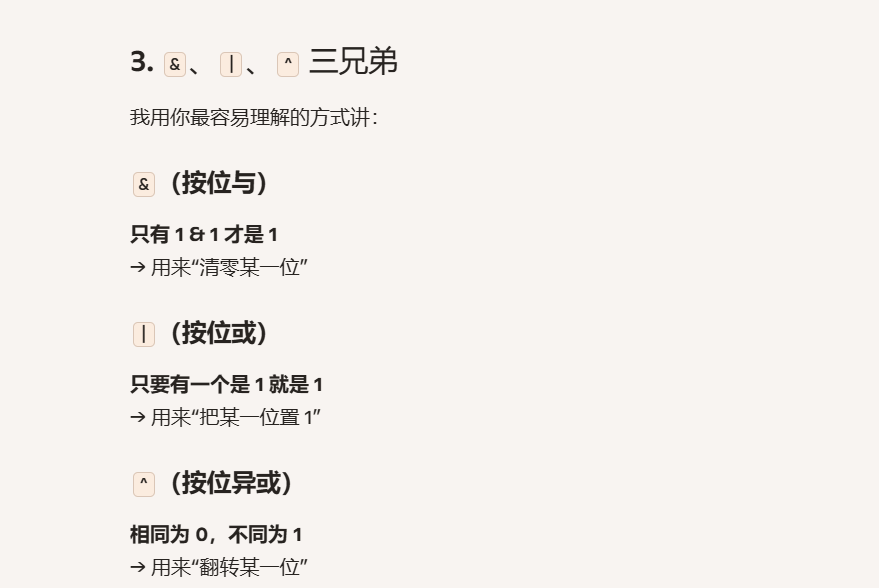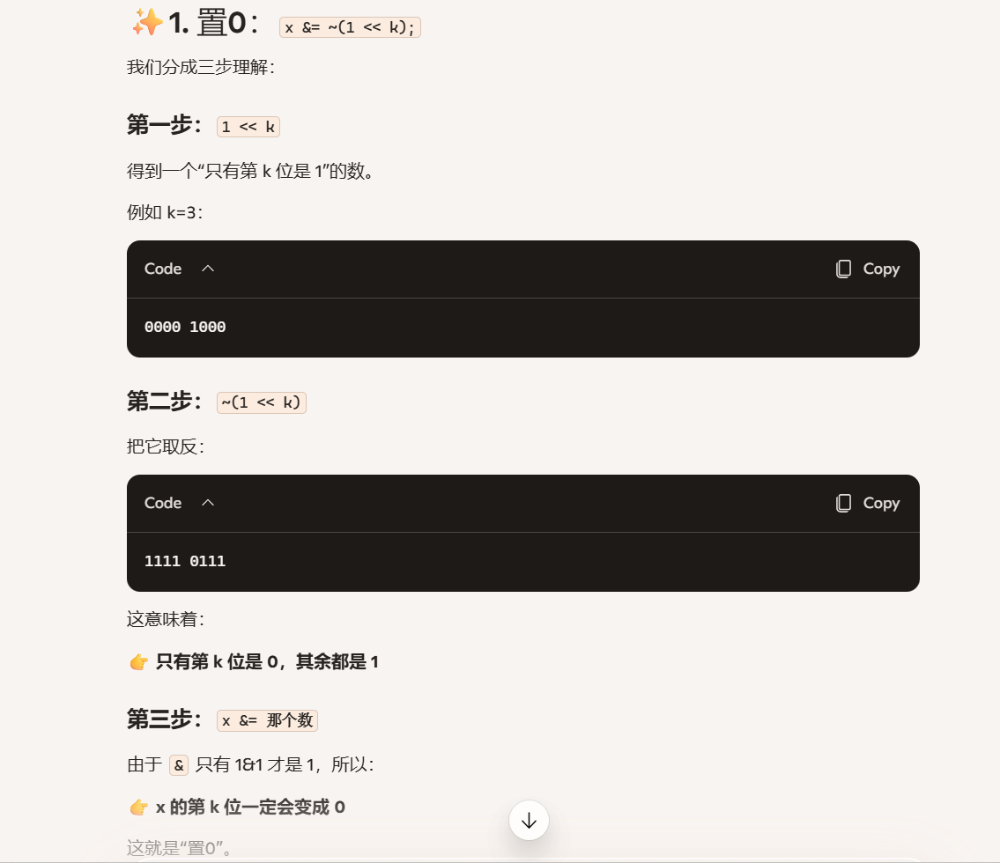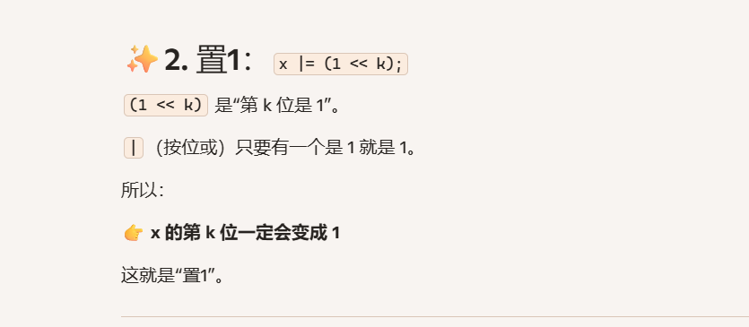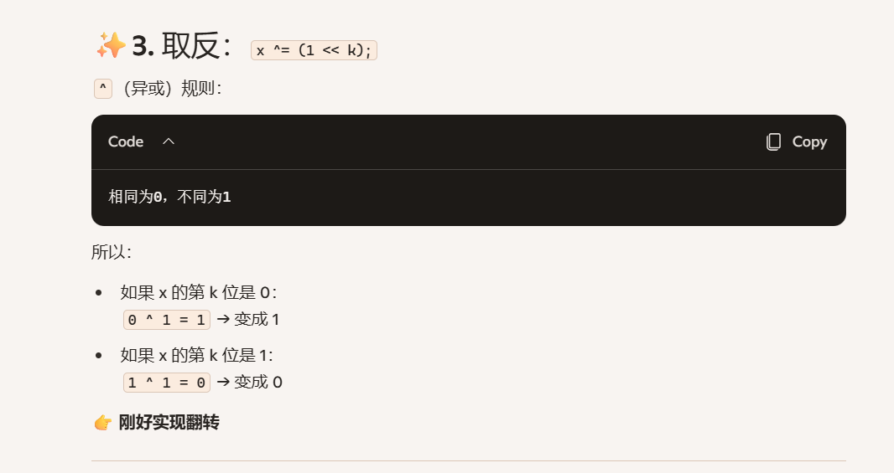
